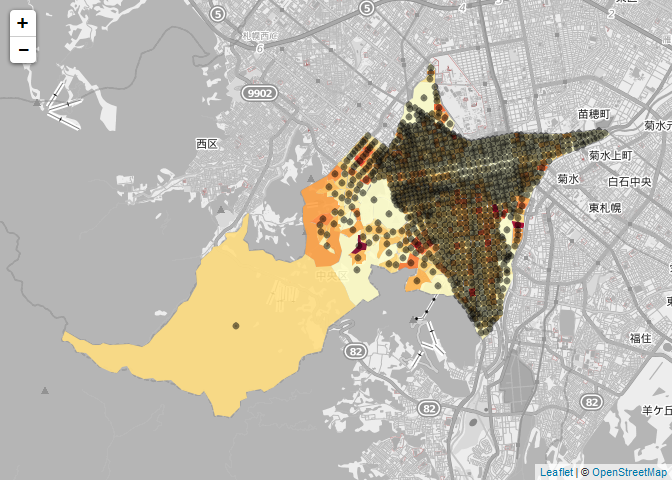

# SappoRoR#6 -ラーメン屋さんになりたい-

@TOC

## データ準備

```r  
    getinfo.shape(shape.file)

    ## Shapefile type: Polygon, (5), # of Shapes: 990

    pj<-CRS("+proj=longlat +datum=WGS84")
    Chuo<- readShapePoly(shape.file,proj4string = pj)


    pj<-CRS("+init=epsg:2454")
    CRSargs(pj)

    ## [1] "+init=epsg:2454 +proj=tmerc +lat_0=44 +lon_0=142.25 +k=0.9999 +x_0=0 +y_0=0 +ellps=GRS80 +towgs84=0,0,0,0,0,0,0 +units=m +no_defs"

    Chuo2<- readShapePoly(shape.file,proj4string = pj)

    str(Chuo@data)

    ## 'data.frame':    990 obs. of  38 variables:
    ##  $ AREA      : num  34241 23602 65333 450562 13707 ...
    ##  $ PERIMETER : num  755 649 1215 2664 536 ...
    ##  $ H22KA01_  : int  13586 13677 13726 13830 13848 13951 14018 14067 14102 14140 ...
    ##  $ H22KA01_ID: int  13585 13676 13725 13829 13847 13950 14017 14066 14101 14139 ...
    ##  $ KEN       : Factor w/ 1 level "01": 1 1 1 1 1 1 1 1 1 1 ...
    ##  $ CITY      : Factor w/ 1 level "101": 1 1 1 1 1 1 1 1 1 1 ...
    ##  $ KEN_NAME  : Factor w/ 1 level "北海道": 1 1 1 1 1 1 1 1 1 1 ...
    ##  $ SITYO_NAME: Factor w/ 1 level "石狩振興局": 1 1 1 1 1 1 1 1 1 1 ...
    ##  $ GST_NAME  : Factor w/ 1 level "札幌市": 1 1 1 1 1 1 1 1 1 1 ...
    ##  $ CSS_NAME  : Factor w/ 1 level "中央区": 1 1 1 1 1 1 1 1 1 1 ...
    ##  $ HCODE     : int  8101 8101 8101 8101 8101 8101 8101 8101 8101 8101 ...
    ##  $ KIHON1    : Factor w/ 81 levels "0200","0300",..: 81 80 79 76 78 77 76 75 76 74 ...
    ##  $ DUMMY1    : Factor w/ 1 level "-": 1 1 1 1 1 1 1 1 1 1 ...
    ##  $ KIHON2    : Factor w/ 31 levels "00","01","02",..: 16 16 16 17 16 16 16 16 22 16 ...
    ##  $ KEYCODE1  : Factor w/ 987 levels "101020000","101030000",..: 987 986 985 980 984 983 979 977 982 974 ...
    ##  $ KEYCODE2  : Factor w/ 987 levels "1010200","1010300",..: 987 986 985 980 984 983 979 977 982 974 ...
    ##  $ AREA_MAX_F: Factor w/ 1 level "M": 1 1 1 1 1 1 1 1 1 1 ...
    ##  $ KIGO_D    : Factor w/ 0 levels: NA NA NA NA NA NA NA NA NA NA ...
    ##  $ N_KEN     : Factor w/ 0 levels: NA NA NA NA NA NA NA NA NA NA ...
    ##  $ N_CITY    : Factor w/ 0 levels: NA NA NA NA NA NA NA NA NA NA ...
    ##  $ N_C1      : int  0 0 0 0 0 0 0 0 0 0 ...
    ##  $ KIGO_E    : Factor w/ 3 levels "E1","E2","E3": NA NA NA NA NA NA NA NA NA NA ...
    ##  $ KIGO_I    : Factor w/ 0 levels: NA NA NA NA NA NA NA NA NA NA ...
    ##  $ TATE      : int  0 0 0 0 0 0 0 0 0 0 ...
    ##  $ DIR       : int  0 0 0 0 0 0 0 0 0 0 ...
    ##  $ HIGHT     : int  50 50 50 50 50 50 50 50 50 50 ...
    ##  $ JIKAKU    : int  10 10 10 10 10 10 10 10 10 10 ...
    ##  $ NMOJI     : int  6 6 5 9 5 5 9 9 9 9 ...
    ##  $ MOJI      : Factor w/ 987 levels "旭ケ丘１丁目",..: 905 903 904 900 898 879 899 869 902 876 ...
    ##  $ SEQ_NO2   : int  13585 13676 13725 13829 13847 13950 14017 14066 14101 14139 ...
    ##  $ KSUM      : int  2 1 8 1 3 3 3 7 2 9 ...
    ##  $ CSUM      : int  2 5 8 1 3 3 3 7 2 12 ...
    ##  $ JINKO     : int  29 518 206 0 136 149 142 285 41 699 ...
    ##  $ SETAI     : int  1 304 108 0 72 72 80 197 20 307 ...
    ##  $ X_CODE    : num  141 141 141 141 141 ...
    ##  $ Y_CODE    : num  43.1 43.1 43.1 43.1 43.1 ...
    ##  $ KCODE1    : Factor w/ 987 levels "0200-00","0300-00",..: 987 986 985 980 984 983 979 977 982 974 ...
    ##  $ KEY_CODE  : Factor w/ 987 levels "011010200","011010300",..: 987 986 985 980 984 983 979 977 982 974 ...
    ##  - attr(*, "data_types")= chr  "N" "N" "N" "N" ...

    Chuo.dc<- data.frame(MOJI=Chuo@data$MOJI,
                         X_CODE=Chuo@data$X_CODE,
                         Y_CODE=Chuo@data$Y_CODE,
                         KEY_CODE=Chuo@data$KEY_CODE,
                         JINKO=Chuo@data$JINKO,
                         SETAI=Chuo@data$SETAI,
                         X_CEN=coordinates(Chuo)[,1],
                         Y_CEN=coordinates(Chuo)[,2])

    knitr::kable(head(Chuo.dc))
```

<table>
<thead>
<tr class="header">
<th align="left"></th>
<th align="left">MOJI</th>
<th align="right">X_CODE</th>
<th align="right">Y_CODE</th>
<th align="left">KEY_CODE</th>
<th align="right">JINKO</th>
<th align="right">SETAI</th>
<th align="right">X_CEN</th>
<th align="right">Y_CEN</th>
</tr>
</thead>
<tbody>
<tr class="odd">
<td align="left">0</td>
<td align="left">北二十二条西</td>
<td align="right">141.3284</td>
<td align="right">43.08521</td>
<td align="left">011017922</td>
<td align="right">29</td>
<td align="right">1</td>
<td align="right">141.3284</td>
<td align="right">43.08521</td>
</tr>
<tr class="even">
<td align="left">1</td>
<td align="left">北二十一条西</td>
<td align="right">141.3285</td>
<td align="right">43.08400</td>
<td align="left">011017921</td>
<td align="right">518</td>
<td align="right">304</td>
<td align="right">141.3285</td>
<td align="right">43.08400</td>
</tr>
<tr class="odd">
<td align="left">2</td>
<td align="left">北二十条西</td>
<td align="right">141.3280</td>
<td align="right">43.08234</td>
<td align="left">011017920</td>
<td align="right">206</td>
<td align="right">108</td>
<td align="right">141.3280</td>
<td align="right">43.08234</td>
</tr>
<tr class="even">
<td align="left">3</td>
<td align="left">北十六条西１６丁目</td>
<td align="right">141.3260</td>
<td align="right">43.07778</td>
<td align="left">01101791616</td>
<td align="right">0</td>
<td align="right">0</td>
<td align="right">141.3260</td>
<td align="right">43.07778</td>
</tr>
<tr class="odd">
<td align="left">4</td>
<td align="left">北十八条西</td>
<td align="right">141.3298</td>
<td align="right">43.08034</td>
<td align="left">011017918</td>
<td align="right">136</td>
<td align="right">72</td>
<td align="right">141.3299</td>
<td align="right">43.08034</td>
</tr>
<tr class="even">
<td align="left">5</td>
<td align="left">北十七条西</td>
<td align="right">141.3302</td>
<td align="right">43.07896</td>
<td align="left">011017917</td>
<td align="right">149</td>
<td align="right">72</td>
<td align="right">141.3301</td>
<td align="right">43.07896</td>
</tr>
</tbody>
</table>

## 人口コロプレス図で全体を把握

```r

    pal <- colorNumeric(
      palette = "YlOrRd",
      domain = Chuo.dc$JINKO
    )

    leaflet::leaflet(Chuo) %>%
      addProviderTiles(provider = "OpenStreetMap.BlackAndWhite") %>%
      addPolygons(stroke = FALSE,
                  fillOpacity = 0.9,
                  color = ~pal(Chuo.dc$JINKO))
```


## 各ポリゴンの代表点を抽出して「世帯」と見立てる

```r
    leaflet::leaflet(Chuo) %>%
      addProviderTiles(provider = "OpenStreetMap.BlackAndWhite") %>%
      addPolygons(stroke = FALSE,
                  fillOpacity = 0.9,
                  color = ~pal(Chuo.dc$JINKO)) %>%
      addCircles(lng = coordinates(Chuo)[,1],lat=coordinates(Chuo)[,2],color = "gray80")
```



## 立地分析（Minsum問題）

```r
    loca<-loca.p(x=Chuo.dc$X_CEN,y=Chuo.dc$Y_CEN,w=Chuo.dc$JINKO)
    (point<-zsummin(loca))

    ## [1] 141.33469  43.05066

    x<- as.data.frame(loca@x)
    y<- as.data.frame(loca@y)
    w<- as.data.frame(loca@w)
    knitr::kable(head(data.frame(x=x,y=y,w=w)))
```

<table>
<thead>
<tr class="header">
<th align="right">loca.x</th>
<th align="right">loca.y</th>
<th align="right">loca.w</th>
</tr>
</thead>
<tbody>
<tr class="odd">
<td align="right">141.3284</td>
<td align="right">43.08521</td>
<td align="right">29</td>
</tr>
<tr class="even">
<td align="right">141.3285</td>
<td align="right">43.08400</td>
<td align="right">518</td>
</tr>
<tr class="odd">
<td align="right">141.3280</td>
<td align="right">43.08234</td>
<td align="right">206</td>
</tr>
<tr class="even">
<td align="right">141.3260</td>
<td align="right">43.07778</td>
<td align="right">0</td>
</tr>
<tr class="odd">
<td align="right">141.3299</td>
<td align="right">43.08034</td>
<td align="right">136</td>
</tr>
<tr class="even">
<td align="right">141.3301</td>
<td align="right">43.07896</td>
<td align="right">149</td>
</tr>
</tbody>
</table>

## 算出されたラーメン屋さんの位置を可視化

```r
    plot(Chuo)
    for(i in 1:nrow(x)){
      arrows(x[i,],y[i,],point[1],point[2],col="red")
    }
    arrows(x[1,],y[1,],point[1],point[2],col="red",lwd=0.2)
```


## leafletでも可視化したい
```r
    #ポリゴンの結合-------------------------

    maptools::gpclibPermit()

    ## [1] FALSE

    Chuo.union<- maptools::unionSpatialPolygons(Chuo,IDs=rep(1,times=nrow(Chuo@data)))
    str(Chuo.union)

    ## Formal class 'SpatialPolygons' [package "sp"] with 4 slots
    ##   ..@ polygons   :List of 1
    ##   .. ..$ :Formal class 'Polygons' [package "sp"] with 5 slots
    ##   .. .. .. ..@ Polygons :List of 1
    ##   .. .. .. .. ..$ :Formal class 'Polygon' [package "sp"] with 5 slots
    ##   .. .. .. .. .. .. ..@ labpt  : num [1:2] 141 43
    ##   .. .. .. .. .. .. ..@ area   : num 0.00513
    ##   .. .. .. .. .. .. ..@ hole   : logi FALSE
    ##   .. .. .. .. .. .. ..@ ringDir: int 1
    ##   .. .. .. .. .. .. ..@ coords : num [1:1267, 1:2] 141 141 141 141 141 ...
    ##   .. .. .. .. .. .. .. ..- attr(*, "dimnames")=List of 2
    ##   .. .. .. .. .. .. .. .. ..$ : NULL
    ##   .. .. .. .. .. .. .. .. ..$ : chr [1:2] "x" "y"
    ##   .. .. .. ..@ plotOrder: int 1
    ##   .. .. .. ..@ labpt    : num [1:2] 141 43
    ##   .. .. .. ..@ ID       : chr "1"
    ##   .. .. .. ..@ area     : num 0.00513
    ##   ..@ plotOrder  : int 1
    ##   ..@ bbox       : num [1:2, 1:2] 141.2 43 141.4 43.1
    ##   .. ..- attr(*, "dimnames")=List of 2
    ##   .. .. ..$ : chr [1:2] "x" "y"
    ##   .. .. ..$ : chr [1:2] "min" "max"
    ##   ..@ proj4string:Formal class 'CRS' [package "sp"] with 1 slot
    ##   .. .. ..@ projargs: chr "+proj=longlat +datum=WGS84 +ellps=WGS84 +towgs84=0,0,0"

    #描画ワクだけ
    (result<-leaflet::leaflet(Chuo.union) %>%
      addProviderTiles(provider = "OpenStreetMap.Mapnik") %>%
      addPolygons(stroke = TRUE,color="gray20"))
```


## 改めて結果を可視化

```r
    #-立地分析leaflet--------------------------------------------------
    loca<-loca.p(x=Chuo.dc$X_CEN,y=Chuo.dc$Y_CEN,w=Chuo.dc$JINKO)
    point<-zsummin(loca)
    x<- as.data.frame(loca@x)
    y<- as.data.frame(loca@y)
    w<- as.data.frame(loca@w)


    resultdata<- data.frame(x=x[1:990,],
                            y=y[1:990,],
                            pointx=rep(point[1],990),
                            pointy=rep(point[2],990))

    knitr::kable(tail(resultdata))
```

<table>
<thead>
<tr class="header">
<th align="left"></th>
<th align="right">x</th>
<th align="right">y</th>
<th align="right">pointx</th>
<th align="right">pointy</th>
</tr>
</thead>
<tbody>
<tr class="odd">
<td align="left">985</td>
<td align="right">141.3443</td>
<td align="right">43.02096</td>
<td align="right">141.3347</td>
<td align="right">43.05066</td>
</tr>
<tr class="even">
<td align="left">986</td>
<td align="right">141.3471</td>
<td align="right">43.02086</td>
<td align="right">141.3347</td>
<td align="right">43.05066</td>
</tr>
<tr class="odd">
<td align="left">987</td>
<td align="right">141.3488</td>
<td align="right">43.02091</td>
<td align="right">141.3347</td>
<td align="right">43.05066</td>
</tr>
<tr class="even">
<td align="left">988</td>
<td align="right">141.3486</td>
<td align="right">43.01963</td>
<td align="right">141.3347</td>
<td align="right">43.05066</td>
</tr>
<tr class="odd">
<td align="left">989</td>
<td align="right">141.3473</td>
<td align="right">43.01900</td>
<td align="right">141.3347</td>
<td align="right">43.05066</td>
</tr>
<tr class="even">
<td align="left">990</td>
<td align="right">141.3455</td>
<td align="right">43.01864</td>
<td align="right">141.3347</td>
<td align="right">43.05066</td>
</tr>
</tbody>
</table>

```r
    test<-result
      for(i in 1:nrow(resultdata)){
        testd<-data.frame(x = as.numeric(resultdata[i, c(1, 3)]),
                          y = as.numeric(resultdata[i, c(2, 4)]))
        test <- test %>% addPolylines(data=testd,
                             lng = ~x,
                             lat = ~y,
                             color="#f30",
                             weight="2")
      }

    test %>%
      setView(lng = point[1], lat = point[2], zoom = 13) %>%
      addPopups(lng=point[1],lat=point[2],popup="here!!!")
```


